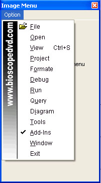



## Popupmenu Background Image

### Description

By this code it is possible to customize your VB Menu.Customize options are Custom Font,Fore color,Back color,Menu mode as XP &amp; VB Look.Capable to add picture to the menu background.Also possible to add Icon.Please see the screen shot.If you like it then Please vote me.I am from Bangladesh
 
### More Info
 

             |
---                |---
**Submitted On**   |2000-01-21 16:12:48
**By**             |[iTech System](https://github.com/Planet-Source-Code/PSCIndex/blob/master/ByAuthor/itech-system.md)
**Level**          |Intermediate
**User Rating**    |4.8 (82 globes from 17 users)
**Compatibility**  |VB 6\.0
**Category**       |[Custom Controls/ Forms/  Menus](https://github.com/Planet-Source-Code/PSCIndex/blob/master/ByCategory/custom-controls-forms-menus__1-4.md)
**World**          |[Visual Basic](https://github.com/Planet-Source-Code/PSCIndex/blob/master/ByWorld/visual-basic.md)
**Archive File**   |[Popupmenu\_2076497212007\.zip](https://github.com/Planet-Source-Code/itech-system-popupmenu-background-image__1-68863/archive/master.zip)

